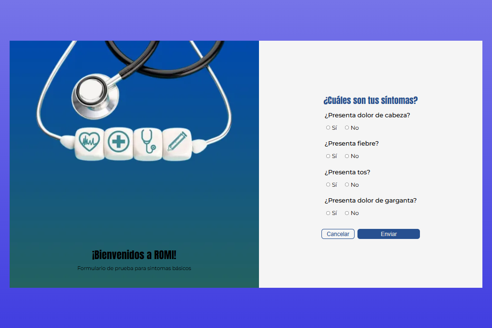

# 🩺 Proyecto técnico ROMI  

Este proyecto es un **formulario interactivo y accesible** que permite a los pacientes reportar síntomas comunes (dolor de cabeza, fiebre, tos y dolor de garganta) y, en caso de presentar alguno, indicar el nivel de dolor del 1 al 10.  

El objetivo fue **practicar formularios dinámicos en React con validaciones** usando **React Hook Form** y **Yup**, aplicando también conceptos de accesibilidad y diseño responsivo.  

---

## ⚙️ Tecnologías utilizadas  
- **React** – creación de la UI.  
- **React Hook Form** – manejo del estado del formulario y validaciones.  
- **Yup** – esquema de validación declarativa.  
- **CSS3** – estilos responsivos y animaciones.  
- **Vite** – bundler rápido para desarrollo local.  

---

## 🚀 Instalación y ejecución en local  

1. Clonar el repositorio:  
   ```bash
   git clone https://github.com/Lautaro-Zarate/prueba-tecnica-romi
   
   cd romi-challenge
   
   npm install
   
   npm run dev

2- Luego entrar al localHost



## 📌 Funcionalidades principales

* **Preguntas dinámicas**: Si el paciente responde **"Sí"**, aparece un input para ingresar nivel de dolor.

* **Validaciones con Yup**:

    * Todos los síntomas deben tener respuesta.

    * Nivel de dolor obligatorio entre 1 y 10 si corresponde.

* **Accesibilidad mejorada**: uso de fieldset, legend, aria-live y mensajes de error legibles por lectores de pantalla.

* **Diseño responsivo**: mobile-first y adaptable desde 768px en adelante.

* Mini animación hecho con CSS al mostrar campos adicionales.